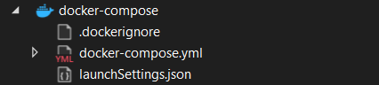

# Микросервис «Банковские счета» (Account Service)

Этот проект представляет собой микросервис для управления банковскими счетами и транзакциями, построенный на современных практиках разработки с использованием .NET, CQRS, Docker и JWT-аутентификации.

## О проекте

Сервис реализует следующие бизнес-сценарии:
*   Открытие и ведение счетов для клиентов (текущие, вклады, кредитные).
*   Регистрация операций пополнения и списания.
*   Выполнение переводов между счетами.
*   Получение выписки по счёту.
*   Защита всех операций с помощью JWT-аутентификации.
*   Ежедневное автоматическое начисление процентов по вкладам.

## 🚀 Технологический стек

*   **.NET 9** / C# 13
*   **ASP.NET Core Web API:** для создания RESTful-сервисов.
*   **PostgreSQL:** в качестве основной реляционной базы данных.
*   **Entity Framework Core 9:** для доступа к данным с использованием подхода `code-first` и миграций.
*   **Hangfire:** для выполнения фоновых задач (ежедневное начисление процентов).
*   **MediatR:** для реализации паттерна CQRS.
*   **FluentValidation:** для декларативной и строгой валидации входящих запросов.
*   **AutoMapper:** для маппинга между доменными моделями и DTO.
*   **xUnit & Testcontainers-DotNet:** для модульного и надежного интеграционного тестирования на реальной БД.
*   **Swashbuckle (Swagger):** для интерактивной документации API.
*   **Docker / Docker Compose:** для контейнеризации и оркестрации всего стека (сервис + БД).

## ✨ Ключевые архитектурные решения

*   **Vertical Slice Architecture:** Структура проекта организована по бизнес-возможностям, а не по техническим слоям.
*   **Custom Result Pattern (`MbResult<T>`)**: Все конечные точки API возвращают стандартизированный объект `MbResult`, который инкапсулирует либо успешный результат (`Value`), либо подробную информацию об ошибке (`Error`). Это обеспечивает предсказуемость и надежность API.
*   **Централизованная обработка ошибок**: `BaseApiController`  унифицирует обработку ошибок валидации, бизнес-логики и системных сбоев, преобразуя их в корректные HTTP-статусы и ответы в формате `MbResult`.
*   **Настроенная валидация**: `FluentValidation` сконфигурирован для прекращения проверки правила после первой ошибки для каждого поля (`CascadeMode.Stop`), что делает ответы API более лаконичными.
*   **Оптимистичная блокировка:** Для предотвращения конфликтов при параллельном доступе используется системная колонка PostgreSQL `xmin` в качестве `concurrency token`. При возникновении конфликта API возвращает HTTP `409 Conflict`.
*   **Транзакционная целостность:** Критически важные операции, такие как перевод средств, выполняются внутри явных транзакций с уровнем изоляции `Serializable` для обеспечения максимальной консистентности данных.
*   **Отказоустойчивые фоновые задачи:** Ежедневное начисление процентов реализовано с Hangfire. Одна главная задача делит всю работу на небольшие пачки (батчи) и ставит их в очередь на параллельную обработку, что обеспечивает масштабируемость и отказоустойчивость.

## 🔐 Аутентификация

Все методы API защищены с помощью JWT-токенов. Для локального развертывания используется **Keycloak**, который запускается вместе с сервисом через `docker-compose`.

*   **Адрес Keycloak:** `http://localhost:8080`
*   **Realm:** `account_service` (преднастроен)
*   **Клиент для Swagger:** `public-client`
*   **Учетные данные для входа в админ-панель Keycloak:** `admin` / `admin`
*   **Тестовый пользователь:** `test_user` / `test`

Чтобы получить токен для работы с API через Swagger:
1.  Запустите проект с помощью `docker-compose up`.
2.  Откройте Swagger UI по адресу `http://localhost:80/swagger`.
3.  Нажмите на кнопку `Authorize` в правом верхнем углу.
4.  В открывшемся окне Swagger автоматически перенаправит вас на страницу входа Keycloak.
5.  Используйте учетные данные тестового пользователя (`test_user` / `test`) для входа или зарегистрируйте нового пользователя (нужно указать все данные, включая почту имя и т.д.)
6.  После успешной аутентификации вы будете перенаправлены обратно в Swagger с активным токеном. Теперь вы можете вызывать защищенные эндпоинты.

## 🏁 Как запустить проект

### Пререквизиты

*   [.NET 9 SDK](https://dotnet.microsoft.com/download/dotnet/9.0)
*   [Docker Desktop](https://www.docker.com/products/docker-desktop/)

### Вариант 1: Запуск с помощью Docker Compose (Рекомендуемый)

Этот способ запускает и сам сервис, и настроенный сервер аутентификации Keycloak.

1.  **Склонируйте репозиторий:**
    ```bash
    git clone https://github.com/P4r4cosm/Account-Service.git
    cd Account-Service
    git checkout feature/account-service-postgres-migration-and-tests 
    ```
2.  **Запустите контейнеры:**
    ```bash
    docker-compose up -d --build
    ```
3.  **Откройте Swagger UI в браузере:**
    *   **API сервиса:** `http://localhost:80/swagger`
    *   **Сервер аутентификации Keycloak:** `http://localhost:8080/`

Сервис будет доступен на 80-м порту *внутри Docker-сети*, который проброшен на `80`-й порт вашего компьютера.

### Вариант 2: Локальный запуск для отладки (без Docker)

Этот способ подходит для быстрой разработки и отладки в IDE. Требует отдельно запущенного сервера аутентификации.

1.  **Склонируйте репозиторий.**
2.  **Откройте решение** `AccountService.sln` в Visual Studio 2022.
3.  **Запустите проект**, выбрав профиль `https` или `http`.
4.  **Откройте Swagger UI в браузере:**
    Перейдите по адресу, указанному в консоли (обычно `https://localhost:7132/swagger`).


### Вариант 3: Запуск с помощью Docker Compose в Visual Studio

Этот способ позволяет запускать весь стек (сервис и Keycloak) прямо из **Visual Studio** с полной интеграцией с Docker Compose, что удобно для отладки и разработки.

1.  **Склонируйте репозиторий:**
    ```bash
    git clone https://github.com/P4r4cosm/Account-Service.git
    cd Account-Service
     git checkout feature/account-service-postgres-migration-and-tests  
    ```

2.  **Откройте решение в Visual Studio 2022:**
    *   Запустите Visual Studio.
    *   Откройте файл `AccountService.sln`.

3.  **Добавьте поддержку оркестратора контейнеров (если не настроено автоматически):**
    *   В **Solution Explorer** кликните правой кнопкой мыши по проекту `Account Service`.
    *   Выберите **`Add`** → **`Container Orchestrator Support...`**.
    *   В открывшемся окне выберите **`Docker Compose`**.
    *   Не заменяйте **`docker-compose.yml`** и **`Dockerfile`**.
    *   Нажмите **OK**.

4.  **Запустите приложение:**
    *   В строке запуска Visual Studio выберите профиль **`docker-compose`**.
    *   Нажмите кнопку **`Run`** (или `F5`).
    *   Visual Studio автоматически выполнит сборку образов, запустит контейнеры через Docker Compose.

5.  **Откройте Swagger UI в браузере:**
    *   **API сервиса:** `http://localhost:80/swagger`
    *   **Сервер аутентификации Keycloak:** `http://localhost:8080/`

> 💡 **Совет:** Если структура `docker-compose` не отображается в Solution Explorer, как на скриншоте ниже, повторите шаг 3.
>
> 

## 🧪 Тестирование

Проект покрыт модульными и интеграционными тестами.

*   **Запуск всех тестов:**
    ```bash
    dotnet test AccountService.sln
    ```
*   **Интеграционные тесты** (`ParallelTransferTests`) используют **Testcontainers-DotNet** для поднятия временного контейнера PostgreSQL, что гарантирует тестирование на чистой и реальной базе данных при каждом запуске.
* Для получения отчёта по покрытию кода тестами необходимо находиться в главной директории проекта и выполнить следующие команды:
```bash
dotnet test AccountService.sln --collect:"XPlat Code Coverage" --results-directory ./coverage/

reportgenerator "-reports:./coverage/**/coverage.cobertura.xml" "-targetdir:./coverage/report" "-reporttypes:Html"
``` 
Тест отчёта будет расположен по пути `coverage/report/index.html`


## 📁 API Эндпоинты

После запуска проекта вся интерактивная документация с примерами доступна по корневому адресу.

| Метод  | URL                                                      | Описание                                 |
| :----- |:---------------------------------------------------------|:-----------------------------------------|
| `POST` | `/api/accounts`                                          | Создать новый счёт                       |
| `GET`  | `/api/accounts`                                          | Получить список счетов (с фильтрацией)   |
| `GET`  | `/api/accounts/{accountId}`                              | Получить счёт по ID                      |
| `GET`  | `/api/accounts/{accountId}/{fieldName}`                  | Получить значение конкретного поля счёта |
| `PUT`  | `/api/accounts/{accountId}`                              | Полностью обновить счёт                  |
| `PATCH`| `/api/accounts/{accountId}`                              | Частично обновить счёт                   |
| `DELETE`| `/api/accounts/{accountId}`                              | Удалить счёт                             |
| `GET`  | `/api/owner/{ownerId}/has-accounts`                      | Проверить, есть ли у клиента счета       |
| `POST` | `/api/accounts/{accountId}/transactions`                 | Зарегистрировать транзакцию по счёту     |
| `GET`  | `/api/accounts/{accountId}/transactions`                 | Получить выписку по счёту                |
| `GET`  | `/api/accounts/{accountId}/transactions/{transactionId}` | Получить транзакцию по ID                |
| `POST` | `/api/transfers`                                         | Выполнить перевод между счетами          |

---

Проект выполнен в рамках стажировки для Модуль Банка.

**Автор:** [Сухов Антон](https://github.com/P4r4cosm)
